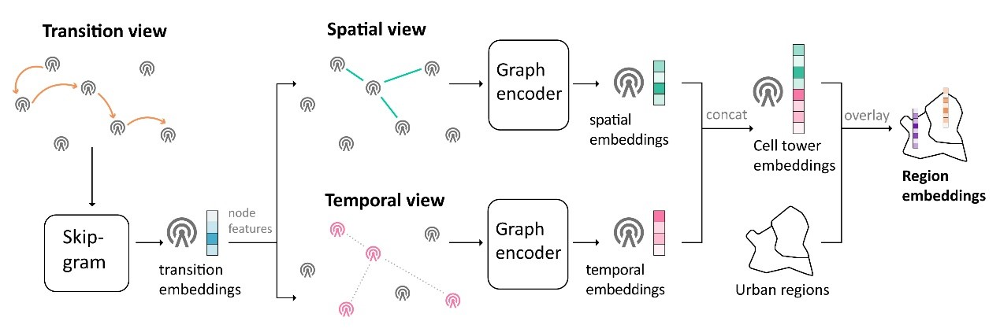

#  Urban region representation learning with human trajectories: a multi-view approach incorporating transition, spatial, and temporal perspectives
This project is linked to a paper published in GISCIENCE & Remote Sensing: Urban region representation learning with human trajectories: a multi-view approach incorporating transition, spatial, and temporal perspectives. In this study, we propose a novel approach MTE for learning effective region representations with human trajectories in a fully unsupervised manner. MTE models three salient information perspectives of trajectory data, transition, spatial, and temporal views, and utilizes varying machine learning techniques based on the traits of different views. 
  

## Requirements
  
- Python >= 3.8  
- torch = 1.13.0
- numpy = 1.25.2
- tqdm
- sklearn
- scipy

## Structure
There are two main scripts in this repository: train.py and tasks.py.


  
## Training  
  ```python
#train spatial view
python train.py --view_name='spatial'
# eval MTE
python tasks.py --task='mte'
   ```
  
## Citation  
  If you find this repository, e.g., the paper, code, and the datasets, useful in your research, please cite the following paper:
